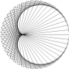

## Latest work

[**String Art**][stringart] [*(code)*][stringartcode]  
[][stringart]

## About rohbot art

rohbot is an art project of coded motion and animation. rohbot art was created by [Rohan Ahmad](https://rohanoahmad.me/), a creative coder and electronics hacker from Australia who now lives in Malaysia.
* [GitHub](https://github.com/rohbot)
* [Instagram](https://www.instagram.com/rohbotboy/)

# rohbot art
  
Follow on [Instagram](https://www.instagram.com/rohbotboy/)

### License, share, learn

Feel free to edit, modify and learn from this [code](https://github.com/rohbot/rohbot.github.io) 
This project is licensed under the MIT License - see the [LICENSE](LICENSE) file for details.

This website is based on [code](https://github.com/owenmcateer/Motus-Art) from [owenmcateer/Motus-Art](https://github.com/) project

[stringart]: https://rohbot.github.io/rohbot.github.io/projects/stringart.html
[stringartcode]: https://github.com/rohbot/rohbot.github.io/blob/master/src/stringart/sketch.js
